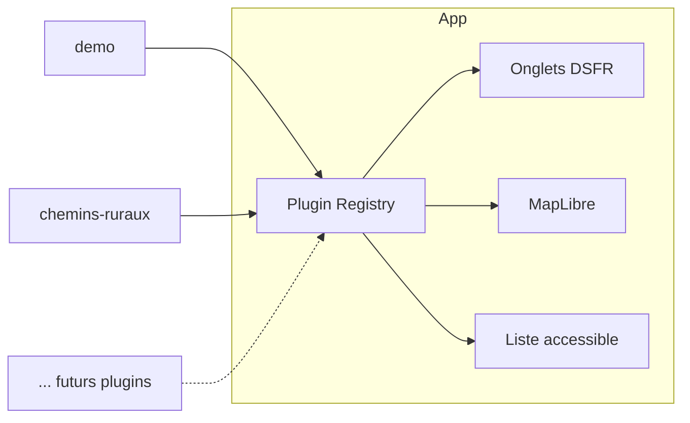

# mes-donnees-geo

Outil cartographique open source permettant aux communes françaises d'éditer leurs données géographiques (contours, chemins ruraux, adresses, etc.) via une architecture **plugin** modulaire.

## Objectifs

- Permettre à chaque commune d'**activer/désactiver** des modules d'édition (« plugins ») selon ses besoins.
- Fournir une **interface accessible RGAA** basée sur l'UI Kit de La Suite numérique.
- S'authentifier via **ProConnect** (identité agent).
- Rester **souverain** : fonds de carte IGN Géoplateforme, MapLibre GL (pas de Mapbox), PostgreSQL/PostGIS.

## Stack technique

| Couche         | Choix                                                         |
| -------------- | ------------------------------------------------------------- |
| Framework      | Next.js 16 (App Router) + TypeScript                          |
| UI             | `@gouvfr-lasuite/ui-components` + `@gouvfr-lasuite/ui-tokens` |
| Cartographie   | MapLibre GL JS + Terra Draw                                   |
| Fonds de carte | IGN Géoplateforme (Plan v2, ortho)                            |
| Auth           | ProConnect (OIDC)                                             |
| Base           | PostgreSQL 16 + PostGIS 3                                     |
| ORM            | Prisma 7 (driver adapter `@prisma/adapter-pg`, ESM)           |

## Architecture plugin

Chaque type de données éditable est encapsulé dans un **plugin** implémentant le contrat `GeoPlugin` (voir [src/plugins/types.ts](src/plugins/types.ts)).



Un plugin déclare :

- son **identifiant**, son **label**, son **icône** ;
- les **types de géométries** qu'il gère (`Point`, `LineString`, `Polygon`) ;
- son **style de couche** MapLibre ;
- son **composant** de formulaire d'attributs ;
- ses **règles de validation** métier ;
- ses **scopes** requis (permissions).

Le **registre** central charge dynamiquement les plugins activés pour la commune connectée. L'onglet courant détermine la couche éditable + le panneau latéral.

## Plugins fournis (V1)

- **`chemins-ruraux`** — Édition des chemins ruraux (lignes) avec attributs (nom, revêtement, statut).

### Plugin `chemins-ruraux`

Le plugin gère la CRUD des **chemins ruraux** d'une commune. Chaque chemin est un
`MultiLineString` GeoJSON dont **chaque `LineString` porte son propre revêtement**
(le tableau `surfaces` a la même longueur que `path.coordinates` — cohérence
vérifiée en base par un `CHECK`).

Modèle métier :

- `id` (UUID v4) · `codeInsee` · `statut` (`draft` / `published` / `certified`)
- `nom?` · `path?: GeoJSON.MultiLineString` · `surfaces: RuralPathSurface[]`
- champs base entity (`createdAt`, `updatedAt`, `deletedAt?`)

Persistance :

- Table `rural_paths` avec :
  - colonne `path JSONB` (source de vérité, lecture/écriture Prisma) ;
  - colonne dérivée `path_geom geometry(MultiLineString, 4326)` (PostGIS)
    maintenue par trigger et indexée en GIST — utilisée pour de futures
    requêtes spatiales (`$queryRaw` uniquement, `Unsupported` côté Prisma).
- Enums PostgreSQL `rural_path_status` et `rural_path_surface`.

Routes Next :

- `/[codeCommune]/chemins-ruraux` — **liste** des chemins (recherche par nom, filtre statut, bouton « Nouveau »).
- `/[codeCommune]/chemins-ruraux/new` — **formulaire vierge**.
- `/[codeCommune]/chemins-ruraux/[pathId]` — **formulaire pré-rempli**.

API serveur :

- `getRuralPaths(codeCommune)` / `getRuralPathById(codeCommune, id)` dans
  `src/lib/db/chemins-ruraux.ts` (mapper Prisma → domaine, filtre `deleted_at IS NULL`).
- Mutations : `createRuralPath`, `updateRuralPath`, `softDeleteRuralPath`
  (le `DELETE` est un soft-delete via `deleted_at`).

Routes REST :

- `POST   /api/plugins/chemins-ruraux` — créer un chemin.
- `PUT    /api/plugins/chemins-ruraux/[pathId]` — mise à jour complète.
- `DELETE /api/plugins/chemins-ruraux/[pathId]` — soft-delete.

Toutes ces routes exigent une session (`requireSession`) et sont scopées au
`codeInsee` de la session. La validation métier partagée
(`src/components/rural-path/validation.ts`) est appelée en amont côté client
_et_ ré-appliquée côté serveur (defense in depth) : cohérence
`surfaces[].length === path.coordinates.length`, statut/surface dans les enums,
`nom` ≤ 200 caractères, coordonnées dans WGS84.

Édition cartographique :

- Le formulaire utilise **Terra Draw** (`terra-draw` +
  `terra-draw-maplibre-gl-adapter`) attaché à l'instance MapLibre via
  `MapContext.mapRef`. Deux modes : `linestring` (tracer un nouveau segment)
  et `select` (déplacer/supprimer des vertices d'un segment existant).
- Chaque `LineString` dessinée devient un segment du `MultiLineString`.
  Le revêtement de chaque segment se choisit dans la liste du formulaire
  (par défaut `terre`). La sauvegarde reconstruit le `MultiLineString`
  à partir du snapshot Terra Draw et l'envoie via l'API REST ci-dessus.

## Authentification

En développement, l'auth ProConnect est **stubbée** : `POST /auth/login` crée une session locale avec une identité fictive. En production, on branche le vrai flux OIDC ProConnect (`openid-client`).

Cookie de session HttpOnly + SameSite=Lax, signé.

## Accessibilité (RGAA)

- Base UI La Suite numérique : contrastes, focus, ARIA de base couverts.
- **Carte** : navigation clavier complète (zoom, pan, sélection via `Tab`), **liste textuelle synchronisée** des entités affichées à côté de la carte, annonces `aria-live` pour les actions d'édition, labels explicites sur tous les outils de dessin.
- Audit RGAA prévu dès la V1.

## Démarrage rapide

```bash
npm install
cp .env.example .env.local
npm run dev
```

Ouvrir http://localhost:3006. Cliquer sur « Se connecter » (stub ProConnect).

### PostGIS (optionnel en dev)

```bash
docker compose up -d
```

### Base de données & migrations

Convention **base entity** : chaque table métier doit exposer `id UUID PK`,
`created_at`, `updated_at`, `deleted_at?`. Les triggers `touch_updated_at`
et le soft-delete via `deleted_at IS NULL` sont la norme.

Commandes utiles :

```bash
npx prisma migrate dev --name mon_changement   # dev : génère + applique
npx prisma migrate deploy                       # prod / CI
npx prisma generate                             # régénère src/generated/prisma
```

Les migrations liées à PostGIS (extensions, types `geometry`, triggers) sont
écrites manuellement en SQL (Prisma ne diff pas ces objets).

## Structure du dépôt

```
src/
├── app/                    Routes Next.js (App Router)
│   ├── auth/               Endpoints ProConnect (stub)
│   ├── carte/              Interface principale (onglets + carte)
│   └── api/                CRUD REST par plugin
├── components/             Composants partagés (Map, Layout…)
├── lib/                    Config, session, repository
└── plugins/                Plugins métier
    ├── registry.ts         Enregistrement des plugins
    ├── types.ts            Contrat GeoPlugin
    └── chemins-ruraux/        Plugin chemins ruraux
```

## Licence

MIT
