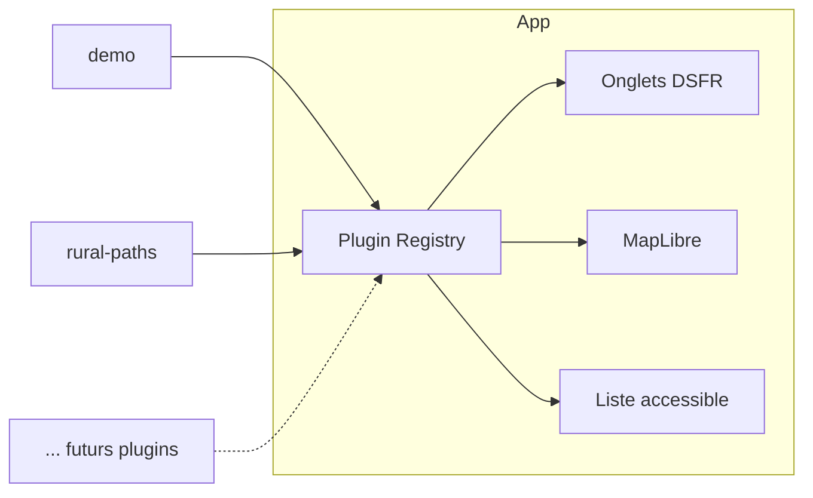

# mes-donnees-geo

Outil cartographique open source permettant aux communes françaises d'éditer leurs données géographiques (contours, chemins ruraux, adresses, etc.) via une architecture **plugin** modulaire.

## Objectifs

- Permettre à chaque commune d'**activer/désactiver** des modules d'édition (« plugins ») selon ses besoins.
- Fournir une **interface accessible RGAA** basée sur l'UI Kit de La Suite numérique.
- S'authentifier via **ProConnect** (identité agent).
- Rester **souverain** : fonds de carte IGN Géoplateforme, MapLibre GL (pas de Mapbox), PostgreSQL/PostGIS.

## Stack technique

| Couche         | Choix                                                            |
| -------------- | ---------------------------------------------------------------- |
| Framework      | Next.js 15 (App Router) + TypeScript                             |
| UI             | `@gouvfr-lasuite/ui-components` + `@gouvfr-lasuite/ui-tokens`    |
| Cartographie   | MapLibre GL JS + Terra Draw                                      |
| Fonds de carte | IGN Géoplateforme (Plan v2, ortho)                               |
| Auth           | ProConnect (OIDC)                                                |
| Base           | PostgreSQL 16 + PostGIS 3                                        |
| ORM            | (à venir) Prisma ou requêtes SQL brutes                          |
| Store dev      | Fichier JSON local (`.data/`) tant que PostGIS n'est pas branché |

## Architecture plugin

Chaque type de données éditable est encapsulé dans un **plugin** implémentant le contrat `GeoPlugin` (voir [src/plugins/types.ts](src/plugins/types.ts)).



Un plugin déclare :

- son **identifiant**, son **label**, son **icône** ;
- les **types de géométries** qu'il gère (`Point`, `LineString`, `Polygon`) ;
- son **style de couche** MapLibre ;
- son **composant** de formulaire d'attributs ;
- ses **règles de validation** métier ;
- ses **scopes** requis (permissions).

Le **registre** central charge dynamiquement les plugins activés pour la commune connectée. L'onglet courant détermine la couche éditable + le panneau latéral.

## Plugins fournis (V1)

- **`demo`** — Plugin générique de démonstration (points), sert de référence pour créer de nouveaux plugins.
- **`rural-paths`** — Édition des chemins ruraux (lignes) avec attributs (nom, revêtement, statut).

## Authentification

En développement, l'auth ProConnect est **stubbée** : `POST /auth/login` crée une session locale avec une identité fictive. En production, on branche le vrai flux OIDC ProConnect (`openid-client`).

Cookie de session HttpOnly + SameSite=Lax, signé.

## Accessibilité (RGAA)

- Base UI La Suite numérique : contrastes, focus, ARIA de base couverts.
- **Carte** : navigation clavier complète (zoom, pan, sélection via `Tab`), **liste textuelle synchronisée** des entités affichées à côté de la carte, annonces `aria-live` pour les actions d'édition, labels explicites sur tous les outils de dessin.
- Audit RGAA prévu dès la V1.

## Démarrage rapide

```bash
npm install
cp .env.example .env.local
npm run dev
```

Ouvrir http://localhost:3006. Cliquer sur « Se connecter » (stub ProConnect).

### PostGIS (optionnel en dev)

```bash
docker compose up -d
```

## Structure du dépôt

```
src/
├── app/                    Routes Next.js (App Router)
│   ├── auth/               Endpoints ProConnect (stub)
│   ├── carte/              Interface principale (onglets + carte)
│   └── api/                CRUD REST par plugin
├── components/             Composants partagés (Map, Layout…)
├── lib/                    Config, session, repository
└── plugins/                Plugins métier
    ├── registry.ts         Enregistrement des plugins
    ├── types.ts            Contrat GeoPlugin
    ├── demo/               Plugin démo
    └── rural-paths/        Plugin chemins ruraux
```

## Licence

MIT
